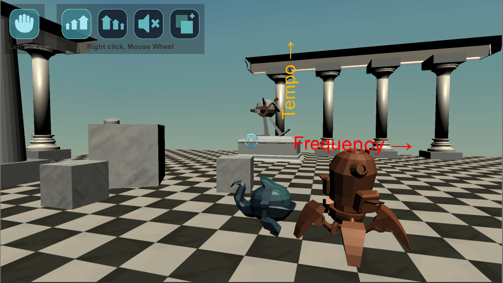
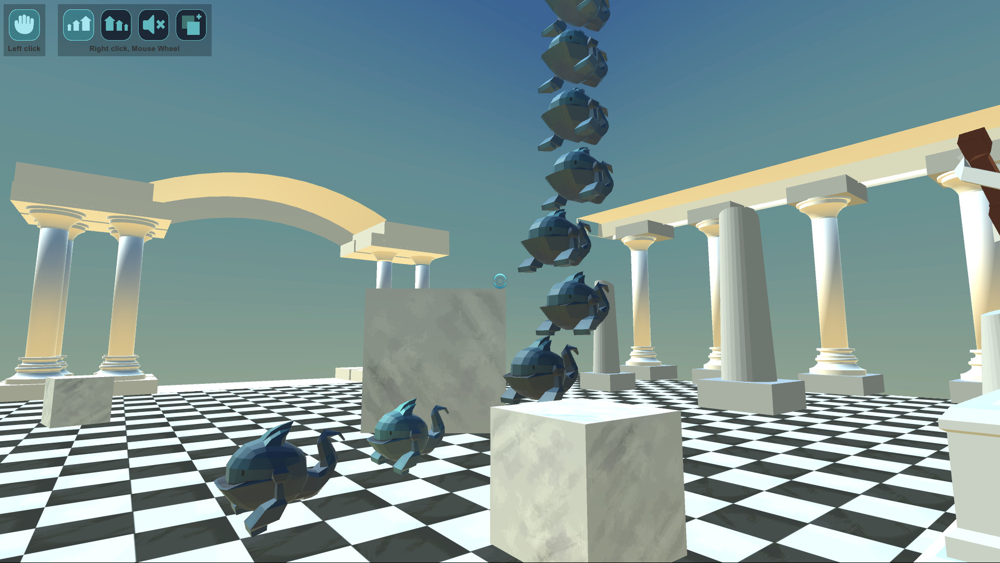

# Silent Witness Jam (Custom Gamejam)
This gamejam was set just by a bunch of friends, experimenting with Unity's sound engine and some 3D!

At the moment it's more of a sandbox, the idea is that one can create/modify given sounds (always playing from figures) by changing their position:
 - Move over the X axis for chaning the sound period
 - Move over the vertical axis for changing the pitch
 - Grow/Shrink for volume
 - Turn off/on

## Controls
### Keyboard/Mouse
 - w, a, s, d to move
 - mouse to look
 - space to jump
 - left click hold things
 - right click selected action
 - 1, 2, 3, 4 choose action for right click 

### Controller (Windows/xbox)
It is currently not possible to switch actions with a controller :( (still a bit rough on the edges).

 - Joysticks to move/look
 - A to jump
 - Left trigger hold things
 - Right trigger selected action

## Roadmap
 - Grow tool is not affecting musical objects
 - Throwing stuff off the map should destroy it
 - Throwing the last piece of music out the map should create a new piece at the center of the map
 - Jumping out the map should restart the level
 - Include already developed gimmics (conveyor/elevator/teleporter) already developed but missing from the current game scene
 - Give a more streamlined experience by teaching the player each mechanic on its own
 - Create a winning condition (portal accessible when puzzle is solved)
 - Playing the desired song from a radio
 - Detecting the right song has been achieved
 - Give feedback when a piece is in the right place

## Team
 - Giancarlo Dessena
 - Philippe Proulx
 - Oriol Ribas
 - Sergio R. Lumley
 - Marta Viader

## Binaries for Download
 - [Windows](Binaries/2017-06-11_Preview/2017-06-11_PreviewWindows.zip)
 - [WebGL](Binaries/2017-06-11_Preview/2017-06-11_PreviewWeb.zip) (Open with Mozilla Firefox)

## Requirements
 - Uses Unity 5.6.1f1

# Tips during development
## Avoiding merge issues in meta files
1. Always create a prefab for each gameobject in the scene
2. Ensure that there is at most one person working on a prefab
3. Ensure that there is at most one person working on each game scene
    -> if you need one of the scenes to adjust a prefab, create a copy of that scene
    -> save prefabs changes by clicking the apply button

## Recomendations
Use Project Rider :)

## libraries to save time
Aron Granberg's A* library -> http://arongranberg.com/astar/download
LeanTween tweening library -> https://github.com/dentedpixel/LeanTween or in the store